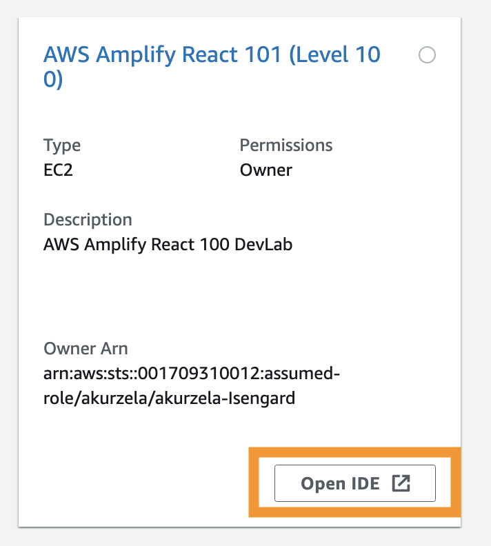
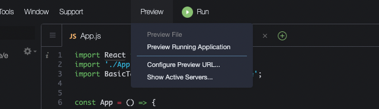

# DevLabs AWS Amplify React 101

AWS Amplify makes it easy for you to create, configure, and implement scalable mobile and web apps powered by AWS. In this workshop, you are going to discover the basics of building simple react application enhanced by the simplicity of hosting provided by AWS Amplify. 

Today we will:
1. Create a react app
2. Add a simple React component
3. Creare a styling css module
4. Host the app on AWS Amplify

## Prerequisites

This lab assumes the following:

It's being executed in an AWS Cloud9 instance provided by the lab co-ordinator.
This repository has been cloned into the default ```~/environment```

ℹ️ You will run this lab in your own AWS account. Please follow directions at the end of the lab to remove resources to avoid future costs.

## Set up

- Go to to AWS Console
- Check to see that you are in US East (N. Virginia) in the top right-hand corner.
- Go to Cloud9
- Go to Account Environments.
- Select Open IDE for **AWS Amplify React 101 (Level 100) **



After you have opened the IDE, open a new terminal.

Run the following to get started. This will configure the environment and clean any artifacts from this lab being run previously.

```cd ~/AWSAmplifyReact101-Cloud9-IDE/
bash resize.sh 20
```
GOOD! The instance has been resized. ✅ Now, we will have a bit more space to install the dependencies needed to run our app. 

Then configure create a react app:

```npx create-react-app amplify_workshop```

Now make sure you enter the right repository:

```cd amplify_workshop```

Install Amplify 

```npm install -g @aws-amplify/cli```

Before we go further make sure you go back to the console and search for CloudFormation -> Stack -> Outputs tab and make sure you have the details like accessKeyId and SecretAccessKey handy.


Now we can finally initialize our Amplify App:

```amplify init ```

You will be asked the following:

```? Enter a name for the project **amplify_workshop**
The following configuration will be applied:

Project information
| Name: amplifyworkshop
| Environment: dev
| Default editor: Visual Studio Code
| App type: javascript
| Javascript framework: react
| Source Directory Path: src
| Distribution Directory Path: build
| Build Command: npm run-script build
| Start Command: npm run-script startxsx

? Initialize the project with the above configuration? **Yes**
Using default provider  awscloudformation
? Select the authentication method you want to use: **AWS profile**
AWS access credentials can not be found.
? Setup new user **No**
? accessKeyId:  ********************
? secretAccessKey:  ****************************************
? region:  **us-west-2**
Adding backend environment dev to AWS Amplify app: 
```

## Adding React components

MUI provides a robust, customizable, and accessible library of foundational and advanced components, enabling you to build your design system and develop React applications faster. We are going to use the code snippet for table creation from the mui documentation [page](https://mui.com/components/tables/ ).

Install Mui

```npm install --save aws-amplify @aws-amplify/ui-react@v1
npm install @mui/material @mui/styled-engine-sc styled-components @emotion/react @emotion/styled
```

We are about to create the very first component of the UI. It is going to be a table. In order to keep our project clean we are going to store all the elements in the folder called "components".

Create a new folder called “components” 

```
cd src && mkdir components
```

and in this folder a file called “Table.js”. Paste the below code into the file.


*Table.js*

```
import * as React from 'react';
import Table from '@mui/material/Table';
import TableBody from '@mui/material/TableBody';
import TableCell from '@mui/material/TableCell';
import TableContainer from '@mui/material/TableContainer';
import TableHead from '@mui/material/TableHead';
import TableRow from '@mui/material/TableRow';
import Paper from '@mui/material/Paper';
 
function createData(name, calories, fat, carbs, protein) {
     return { name, calories, fat, carbs, protein };
 }

 const rows = [
     createData('Frozen yoghurt', 159, 6.0, 24, 4.0),
     createData('Ice cream sandwich', 237, 9.0, 37, 4.3),
     createData('Eclair', 262, 16.0, 24, 6.0),
     createData('Cupcake', 305, 3.7, 67, 4.3),
     createData('Gingerbread', 356, 16.0, 49, 3.9),
 ];

export default function BasicTable() {
    return (
        <TableContainer component={Paper}>
            <Table sx={{ minWidth: 650 }} aria-label="simple table">
                <TableHead>
                   <TableRow>
                    <TableCell>Dessert (100g serving)</TableCell>
                    <TableCell align="right">Calories</TableCell>
                    <TableCell align="right">Fat&nbsp;(g)</TableCell>
                    <TableCell align="right">Carbs&nbsp;(g)</TableCell>
                    <TableCell align="right">Protein&nbsp;(g)</TableCell>
                  </TableRow>
                </TableHead>
                <TableBody>
          {rows.map((row) => (
            <TableRow
              key={row.name}
              sx={{ '&:last-child td, &:last-child th': { border: 0 } }}
            >
              <TableCell component="th" scope="row">
                {row.name}
              </TableCell>
              <TableCell align="right">{row.calories}</TableCell>
              <TableCell align="right">{row.fat}</TableCell>
              <TableCell align="right">{row.carbs}</TableCell>
              <TableCell align="right">{row.protein}</TableCell>
            </TableRow>
          ))}
        </TableBody>
            </Table>
        </TableContainer>
    );
}
```

Now import that table to our main page using below code. Open the App.js file and paste there the code.

**App.js**

```
import React from 'react';
import './App.css';
import BasicTable from './components/Table';


const App = () => {

  return (
    <div className="App">
      <div><BasicTable /></div>
      <button>This is blue</button>
    </div>
  );
}

export default App;
```

I think we should have a little look into how our app looks like. Go to the terminal and run 

```npm start```

to start the app locally and next go to the *Preview* next to the *Run* button and click on *Preview Running App*.



How does it look? I think we can allign it  a bit better. Maybe play with the colors? Let's see how can we impact the style of the component. We are going to position or table in the middle and change the color of the button at the bottom of the table.

Let's stop the server by going back to the terminal and pressing *control+c*. 

## Adding a CSS module 

Below you can find an example of the CSS module that we are going to use to manipulate the look of the buttons as well as the table component.

1. In the *scrc* directory create a file called *styles.module.css* and paste there the below code so that it is amplify_workshop/src/styles.module.css.

*styles.module.css*

```

.tableA {
    max-width: 80%; /*specifies the max width of the table in regards to the full width of the desktop*/
    margin: 0 auto;
    margin-top: 40px;
}

.button {
    background : #1E90FF; /*this changes the color of the button*/
    margin: 10px; /*this adds some margin aorund the button*/
    border: none; /*removes the boarder around the button*/
    padding: 10px 25px ; /*increases the space inside the element between the element and the border*/
    color:white; /*changes font of the button to white*/
    font-weight: 600; /*changes the font of the button*/
}

```


Now let's add the stylesheet to our main App.js file.

*App.js*

```
import React from 'react';
import stylesheet from './styles.module.css';
import './App.css';
import BasicTable from './components/Table';


const App = () => {

  return (
    <div className="App">
      <div className={stylesheet.tableA} ><BasicTable /></div>
      <button className={stylesheet.button}>This is blue</button>
    </div>
  );
}

export default App;
```

Now make sure you are in *~/environment/amplify_workshop* directory and add AWS Amplify hosting.

```
pwd
```
If you got /home/ec2-user/environment/amplify_workshop/src - All good! Continue! 

```
amplify add hosting
```

 You will be asked the following:

```
✔ Select the plugin module to execute · **Hosting with Amplify Console (Managed hosting with custom domains, Continuous deployment)**
? Choose a type **Manual deployment**

You can now publish your app using the following command:

Command: amplify publish
```

and push everything to AWS Amplify. 

```
amplify publish
```

You will be asked the following:

```
✔ Successfully pulled backend environment dev from the cloud.

    Current Environment: dev
    
┌──────────┬────────────────┬───────────┬───────────────────┐
│ Category │ Resource name  │ Operation │ Provider plugin   │
├──────────┼────────────────┼───────────┼───────────────────┤
│ Hosting  │ amplifyhosting │ Create    │ awscloudformation │
└──────────┴────────────────┴───────────┴───────────────────┘
? Are you sure you want to continue? **Yes**
⠏ Updating resources in the cloud. This may take a few minutes...

```

In the meantime Amplify is building all the resources to make our app available. 


Okay! if you see in the console the view simmilar to this:

```
CREATE_IN_PROGRESS AmplifyBranch                                                        AWS::Amplify::Branch       Tue Apr 26 2022 08:56:19 GMT+0000 (Coordinated Universal Time) Resource creation Initiated
CREATE_COMPLETE    AmplifyBranch                                                        AWS::Amplify::Branch       Tue Apr 26 2022 08:56:19 GMT+0000 (Coordinated Universal Time)                            
CREATE_COMPLETE    amplify-amplifyworkshop-dev-82318-hostingamplifyhosting-712PBVS8TWSQ AWS::CloudFormation::Stack Tue Apr 26 2022 08:56:20 GMT+0000 (Coordinated Universal Time)                            
⠴ Updating resources in the cloud. This may take a few minutes...

CREATE_COMPLETE                     hostingamplifyhosting             AWS::CloudFormation::Stack Tue Apr 26 2022 08:56:23 GMT+0000 (Coordinated Universal Time) 
UPDATE_COMPLETE_CLEANUP_IN_PROGRESS amplify-amplifyworkshop-dev-82318 AWS::CloudFormation::Stack Tue Apr 26 2022 08:56:25 GMT+0000 (Coordinated Universal Time) 
UPDATE_COMPLETE                     amplify-amplifyworkshop-dev-82318 AWS::CloudFormation::Stack Tue Apr 26 2022 08:56:26 GMT+0000 (Coordinated Universal Time) 
✔ All resources are updated in the cloud


Publish started for amplifyhosting

> amplify_workshop@0.1.0 build
> react-scripts build

Creating an optimized production build...
Compiled successfully.

File sizes after gzip:

  67.13 kB  build/static/js/main.8e4b87d1.js
  1.79 kB   build/static/js/787.350f4947.chunk.js
  603 B     build/static/css/main.b9267c8e.css

The project was built assuming it is hosted at /.
You can control this with the homepage field in your package.json.

The build folder is ready to be deployed.
You may serve it with a static server:

  npm install -g serve
  serve -s build

Find out more about deployment here:

  https://cra.link/deployment

✔ Zipping artifacts completed.
✔ Deployment complete!
https://dev.d1r86buzj4a8xm.amplifyapp.com

```

make sure to click at the link at the bottom and see your new app! Congrats! ✅ 


## Delete the resources ✅

In order to remove the reesources, please make sure that you run the following command. 

```
amplify delete
```

## Tell us what you think 

Did you like the Lab? Please leave us feedback to let us know how we did and for us to improve in future labs. If the QR code below doesn't work, you can click on the link [here](https://eventbox.dev/survey/VZCG7CZ) to let us know what you think about it.


## License

This library is licensed under the MIT-0 License. See the LICENSE file.
